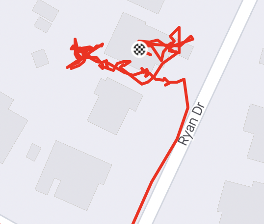

# everywhere

## Tools

```
node tools <command>
```

### Commands

#### `fetch-strava-trips`

#### `list-s3-videos`

Display a list of videos in the S3 bucket.

#### `cloudflare`

Experimental. Load a video from S3 to Cloudflare Stream.

`find-junk-trip-data`

Finds strava trips that have many points very close together. This is often due to forgetting to stop the recording.



## Datasets

`everywhere-2015-v1`

The original dataset from riding every street in Somerville in 2015.
